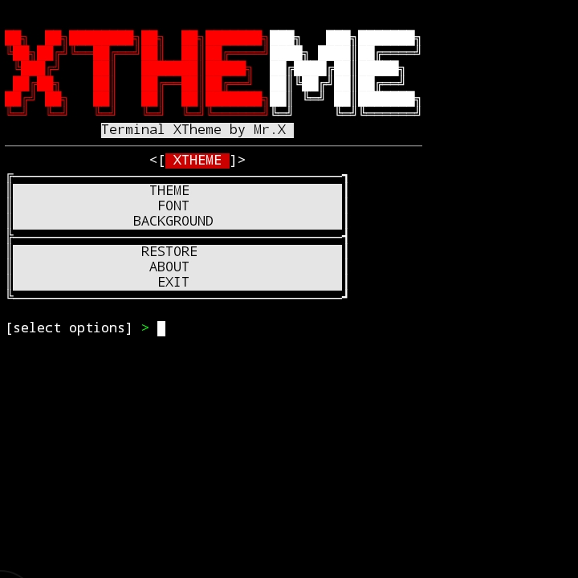

<div style="text-align: center;">
  
</div>

### • Information
<a href="#">
  
</a><br>

<a href="https://link-ke-halaman-tema">
  
</a>

<a>
  
</a>

<a>
  
</a>

### • Description
**XTheme** is a simple tool designed to enhance the user experience in **Termux**. With this tool, you can customize the theme, font, and terminal background to suit your preferences. Although the current features are limited, I plan to add more exciting features in the future.<br>

### • Tools Usage Commands
```bash
$ pkg install git

$ pkg install python -y

$ git clone https://github.com/Whomrx666/XTheme

$ cd XTheme

$ bash install.sh
```
## Instructions
- **first**: Install tools according to the instructions above
- **second**: After entering, enter the token. If you don't know, you can contact Mr. X for the token
- **third**: After entering the token, you will automatically be taken to the tools and all you have to do is choose the theme you want to use
- **last**: The tool will automatically change your Termux theme according to what you choose

## Observation
This is a tool for education only, I am not responsible for any misuse
### Original Author
<a href="https://github.com/Whomrx666"></a>

### <<< If you copy , Then Give me The Credits >>>

## CONNECT WITH ME :

[](https://whomrxhackers.blogspot.com/)
[](https://twitter.com/whomrx666)
[](https://youtube.com/@whomrx666)
[](https://facebook.com/https://www.facebook.com/whomrx.666)
[](https://t.me/@Whomr_X)
[](mailto:whomrx666@gmail.com)
[](https://www.tiktok.com/@whomr.x)

**If you want to donate, click on the button**
<a href="https://saweria.co/whomrx"></a>

### • XTheme Image
<div style="display: flex; justify-content: space-between;">
  
  
  
  
</div>

### Visitors :
